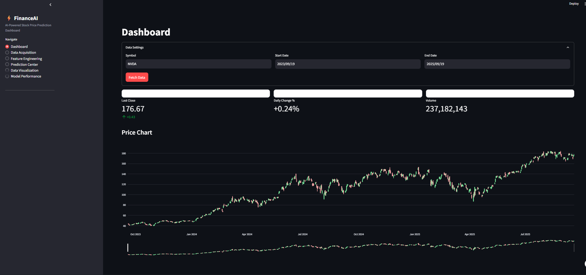
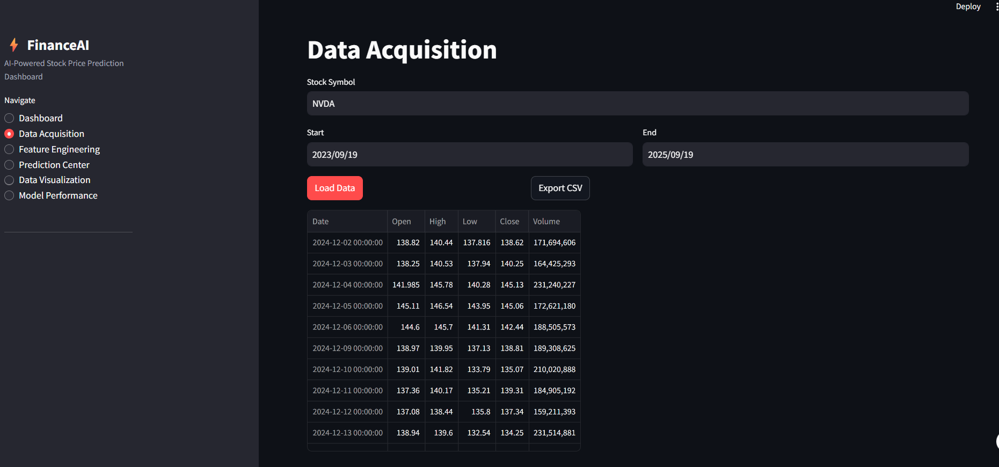
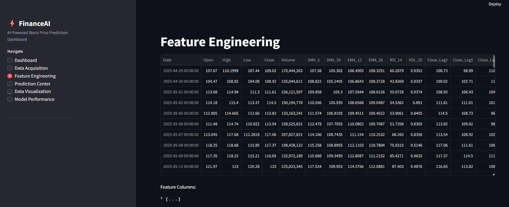
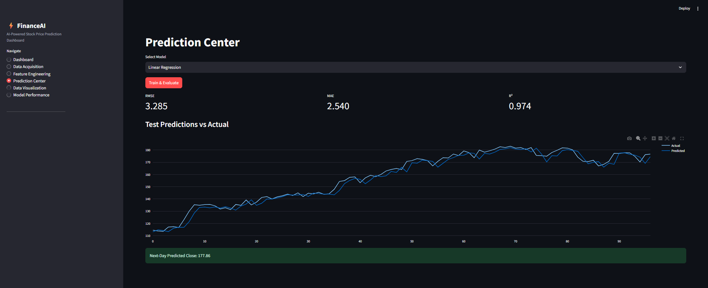
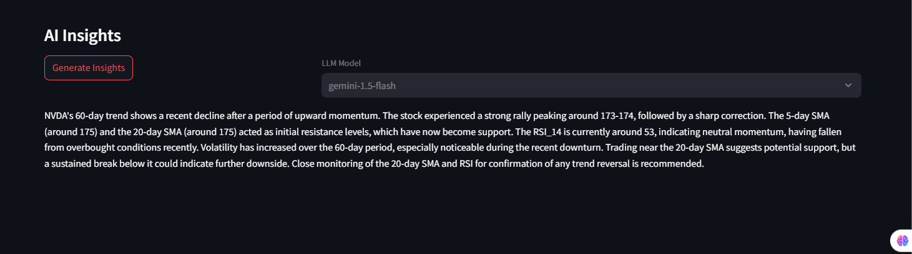
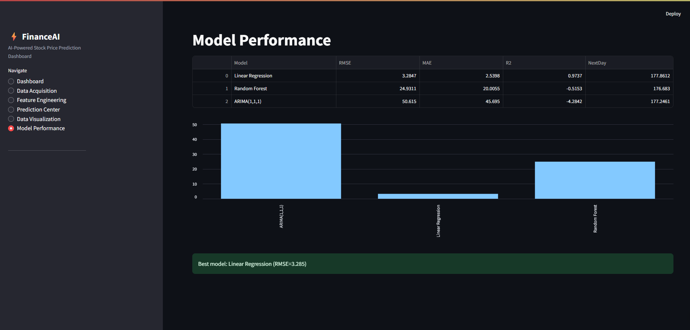

# FinanceAI 🚀⚡
**AI-Powered Stock Price Prediction Dashboard**

A comprehensive financial analysis and prediction platform that leverages machine learning algorithms to forecast stock prices. Built with Streamlit, this application provides real-time data acquisition, feature engineering, multiple ML models, and AI-powered insights using Google's Gemini API.


## 🌟 Features

### 📊 **Multi-Module Architecture**
- **Dashboard**: Real-time overview with key metrics and price charts
- **Data Acquisition**: Smart data fetching with caching and fallback providers
- **Feature Engineering**: Advanced technical indicators and feature creation
- **Prediction Center**: Multiple ML models for price forecasting
- **Data Visualization**: Interactive charts with AI-powered insights
- **Model Performance**: Comprehensive model comparison and evaluation

### 🤖 **Machine Learning Models**
- **Linear Regression**: Fast baseline predictions with standardized features
- **Random Forest**: Ensemble learning with hyperparameter optimization
- **ARIMA(1,1,1)**: Time series analysis for trend-based forecasting

### 🧠 **AI-Powered Insights**
- Integration with Google Gemini API for intelligent market analysis
- Real-time technical analysis and trend interpretation
- Support for multiple Gemini models (2.5-pro, 1.5-pro, 1.5-flash)

### 📈 **Technical Indicators**
- Simple Moving Averages (SMA 5, SMA 20)
- Exponential Moving Averages (EMA 12, EMA 26)
- Relative Strength Index (RSI 14)
- Price volatility calculations
- Lag features for temporal patterns

## 🏗️ Architecture

```
FinanceAI/
├── app.py                 # Main Streamlit application
├── modules/               # Core functionality modules
│   ├── data.py           # Data acquisition and caching
│   ├── features.py       # Feature engineering and technical indicators
│   └── models.py         # ML models and evaluation metrics
├── cache/                # Local data cache for improved performance
├── .streamlit/           # Streamlit configuration
│   └── secrets.toml      # API keys and secrets
├── .venv/                # Virtual environment
├── requirements.txt      # Python dependencies
└── README.md            # This documentation
```

## 🚀 Quick Start

### Prerequisites
- Python 3.8+
- pip package manager
- Internet connection for data fetching

### Installation

1. **Clone or download the project**
```bash
git clone <your-repo-url>
cd "AI STOCK PREDICTION"
```

2. **Create and activate virtual environment**
```bash
python -m venv .venv
# Windows
.venv\Scripts\activate
# macOS/Linux
source .venv/bin/activate
```

3. **Install dependencies**
```bash
pip install -r requirements.txt
```

4. **Configure API Keys (Optional)**
   - For AI insights, add your Gemini API key to `.streamlit/secrets.toml`:
   ```toml
   GEMINI_API_KEY = "your_gemini_api_key_here"
   ```
   - Or set it directly in `app.py` in the `HARD_CODED_GEMINI_API_KEY` variable

5. **Run the application**
```bash
streamlit run app.py
```

6. **Access the dashboard**
   - Open your browser to `http://localhost:8501`

## 📱 Module Documentation

### 1. Dashboard Module


**Purpose**: Central hub providing real-time stock overview and key performance metrics.

**Features**:
- Interactive stock symbol input with data range selection
- Real-time key performance indicators (KPIs):
  - Last closing price with daily change
  - Percentage change indicators
  - Trading volume metrics
- Candlestick chart with moving averages overlay
- Session state management for seamless navigation

**Usage**:
1. Enter stock symbol (e.g., AAPL, GOOGL, MSFT)
2. Select date range for analysis
3. Click "Fetch Data" to load real-time data
4. View KPIs and interactive price chart

---

### 2. Data Acquisition Module


**Purpose**: Intelligent data fetching system with caching and multiple data providers.

**Features**:
- **Primary Data Source**: Yahoo Finance via yfinance library
- **Fallback Provider**: Stooq for reliable data access
- **Smart Caching System**: 
  - MD5-based cache keys for efficient storage
  - Automatic cache directory management
  - Cache validation and reuse
- **Export Functionality**: CSV export for external analysis
- **Data Display**: Tabular view of recent trading data

**Technical Implementation**:
```python
# Cache key generation
def _cache_key(symbol: str, start: str, end: str) -> str:
    raw = f"{symbol}|{start}|{end}".encode()
    return hashlib.md5(raw).hexdigest()

# Dual-provider data fetching
try:
    df = yf.download(symbol, start=start, end=end)
except:
    df = _fetch_from_stooq(symbol)  # Fallback
```

---

### 3. Feature Engineering Module


**Purpose**: Advanced technical analysis and feature creation for ML models.

**Generated Features**:
- **Moving Averages**: SMA_5, SMA_20, EMA_12, EMA_26
- **Momentum Indicators**: RSI_14 (Relative Strength Index)
- **Volatility Measures**: VOL_20 (20-day rolling volatility)
- **Lag Features**: Close_Lag1, Close_Lag5, Close_Lag10
- **Price Relationships**: High/Low spreads, volume patterns

**Technical Indicators**:
```python
# RSI Calculation
delta = df['Close'].diff()
gain = delta.clip(lower=0)
loss = -delta.clip(upper=0)
rs = gain.rolling(14).mean() / (loss.rolling(14).mean() + 1e-9)
rsi = 100 - (100 / (1 + rs))

# Volatility Calculation
returns = df['Close'].pct_change()
volatility = returns.rolling(20).std() * np.sqrt(252)
```

---

### 4. Prediction Center Module


**Purpose**: Multi-model machine learning platform for stock price forecasting.

**Available Models**:

1. **Linear Regression**
   - Pipeline with StandardScaler preprocessing
   - Fast baseline predictions
   - Feature importance analysis

2. **Random Forest**
   - Ensemble learning with 300 estimators
   - Hyperparameter optimization
   - Robust against overfitting

3. **ARIMA(1,1,1)**
   - Time series analysis
   - Trend and seasonality modeling
   - Walk-forward validation

**Evaluation Metrics**:
- **RMSE**: Root Mean Square Error
- **MAE**: Mean Absolute Error
- **R²**: Coefficient of determination

**Workflow**:
1. Select preferred ML model
2. Click "Train & Evaluate" for model training
3. View performance metrics and predictions
4. Get next-day price forecast

---

### 5. Data Visualization Module



**Purpose**: Advanced charting and AI-powered market analysis.

**Visualization Components**:
- **Candlestick Charts**: OHLC data with moving averages
- **Technical Indicators**: RSI oscillator display
- **Interactive Elements**: Zoom, pan, hover tooltips

**AI Insights Feature**:
- **Gemini Integration**: Real-time market analysis
- **Model Selection**: Choose between Gemini 2.5-pro, 1.5-pro, 1.5-flash
- **Intelligent Analysis**: 
  - Trend identification and momentum analysis
  - Support/resistance levels from SMAs
  - RSI interpretation and volatility assessment
  - Actionable trading insights (120-180 words)

**AI Prompt Engineering**:
```python
def build_insights_prompt(symbol, prices, features, next_pred=None):
    return f"""
    Analyze {symbol} based on recent 60 trading days.
    Summarize trend, momentum, support/resistance, RSI, volatility.
    Latest close: {latest_close:.2f}
    Model prediction: {next_pred:.2f}
    Be concise and actionable.
    """
```

---

### 6. Model Performance Module


**Purpose**: Comprehensive model comparison and performance benchmarking.

**Features**:
- **Automated Model Training**: Trains all three models simultaneously
- **Performance Ranking**: Models sorted by RMSE (ascending)
- **Comparative Analysis**: Side-by-side metric comparison
- **Best Model Selection**: Automatic identification of top performer
- **Next-Day Predictions**: All models provide forward-looking forecasts

**Performance Metrics**:
```python
def metrics_dict(y_true, y_pred):
    return {
        "RMSE": np.sqrt(mean_squared_error(y_true, y_pred)),
        "MAE": mean_absolute_error(y_true, y_pred),
        "R2": r2_score(y_true, y_pred)
    }
```

**Model Comparison Workflow**:
1. Automatic feature preparation and target variable creation
2. Time series cross-validation for each model
3. Performance metric calculation and ranking
4. Visual comparison via bar charts
5. Best model recommendation

## 🔧 Technical Specifications

### Dependencies
```python
# Core Framework
streamlit==1.39.0          # Web application framework
pandas==2.2.3              # Data manipulation
numpy==2.1.3               # Numerical computing

# Machine Learning
scikit-learn==1.5.2        # ML algorithms and preprocessing
statsmodels==0.14.4        # Statistical modeling (ARIMA)

# Visualization
plotly==5.24.1             # Interactive charts

# Data Sources
yfinance==0.2.44           # Yahoo Finance API

# AI Integration
google-generativeai==0.7.2 # Gemini API client
```

### Performance Optimizations
- **Caching Strategy**: `@st.cache_data` for expensive operations
- **Session State**: Persistent data across page navigation
- **Lazy Loading**: Features computed only when needed
- **Efficient Data Storage**: Compressed CSV caching

### Data Flow Architecture
```
Raw Stock Data → Feature Engineering → ML Training → Predictions → Visualization
     ↓              ↓                    ↓            ↓           ↓
  Cache Layer   Technical Analysis   Model Evaluation  Forecasts  AI Insights
```

## 🎯 Use Cases

### For Individual Investors
- **Portfolio Analysis**: Track and analyze stock performance
- **Technical Analysis**: Identify entry/exit points using indicators
- **Price Forecasting**: ML-based next-day predictions
- **Risk Assessment**: Volatility analysis and trend identification

### For Financial Analysts
- **Model Comparison**: Evaluate different forecasting approaches
- **Feature Importance**: Understand which indicators drive predictions
- **Backtesting**: Historical performance validation
- **Research**: Export data for external analysis

### For Algorithmic Trading
- **Signal Generation**: RSI, SMA crossovers for trading signals
- **Model Integration**: API-ready predictions for automated systems
- **Performance Monitoring**: Real-time model accuracy tracking

### For Educational Purposes
- **ML Learning**: Understand different prediction algorithms
- **Financial Markets**: Learn technical analysis concepts
- **Data Science**: End-to-end ML pipeline demonstration

## 🔐 Security & Configuration

### API Key Management
```python
# Method 1: Environment variable
GEMINI_API_KEY = os.getenv("GEMINI_API_KEY")

# Method 2: Streamlit secrets
GEMINI_API_KEY = st.secrets["GEMINI_API_KEY"]

# Method 3: Direct assignment (development only)
HARD_CODED_GEMINI_API_KEY = "your_api_key_here"
```

### Data Privacy
- **Local Caching**: All data stored locally, no external transmission
- **No User Data Collection**: Application doesn't store personal information
- **API Security**: Secure API key handling and validation

## 🚀 Advanced Features

### Custom Styling
```css
.brand-title {
    font-weight: 700; 
    font-size: 1.5rem; 
    display: flex; 
    gap: .5rem; 
    align-items: center;
}

.metric-card {
    padding: 16px;
    border: 1px solid #e5e7eb;
    border-radius: 10px;
    background: #fff;
}
```

### Error Handling
- **Graceful Degradation**: Fallback data sources
- **Exception Management**: Comprehensive try-catch blocks
- **User Feedback**: Clear error messages and loading states

### Scalability Considerations
- **Modular Architecture**: Separated concerns in modules
- **Stateless Design**: Easy horizontal scaling
- **Cache Management**: Automatic cleanup and optimization

## 🛠️ Development & Contributing

### Project Structure Best Practices
- **Separation of Concerns**: Data, features, models in separate modules
- **DRY Principle**: Reusable functions and components
- **Type Hints**: Enhanced code readability and IDE support

### Future Enhancements
- [ ] Real-time data streaming
- [ ] Additional ML models (LSTM, GRU)
- [ ] Portfolio optimization features
- [ ] Advanced backtesting framework
- [ ] API endpoints for external integration
- [ ] User authentication and saved preferences
- [ ] Multi-asset correlation analysis
- [ ] News sentiment analysis integration

### Testing Strategy
```python
# Unit tests for core functions
def test_cache_key_generation():
    assert _cache_key("AAPL", "2023-01-01", "2023-12-31") == expected_hash

def test_feature_engineering():
    sample_data = create_sample_ohlcv()
    features = clean_and_engineer(sample_data)
    assert "RSI_14" in features.columns
    assert "SMA_20" in features.columns
```

## 📚 Resources & Documentation

### External APIs
- **Yahoo Finance**: Primary data source via yfinance
- **Stooq**: Fallback data provider
- **Google Gemini**: AI insights and analysis

### Learning Resources
- [Streamlit Documentation](https://docs.streamlit.io/)
- [Scikit-learn User Guide](https://scikit-learn.org/stable/user_guide.html)
- [Plotly Python Documentation](https://plotly.com/python/)
- [Technical Analysis Library](https://technical-analysis-library-in-python.readthedocs.io/)

## 📞 Support & Contact

### Troubleshooting
1. **Installation Issues**: Ensure Python 3.8+ and pip are properly installed
2. **API Errors**: Verify internet connection and API key validity
3. **Performance Issues**: Clear cache directory and restart application
4. **Data Loading Problems**: Check symbol validity and date ranges

### Common Issues & Solutions

**Issue**: "Module not found" error
```bash
# Solution: Activate virtual environment
.venv\Scripts\activate  # Windows
pip install -r requirements.txt
```

**Issue**: Gemini API not working
```python
# Solution: Check API key configuration
# Verify key in .streamlit/secrets.toml or app.py
```

**Issue**: No data for symbol
```bash
# Solution: Try different symbol format
# Use "AAPL" instead of "APPLE"
# Verify symbol exists on Yahoo Finance
```

---

## 📄 License

This project is open-source and available under the MIT License. Feel free to use, modify, and distribute according to the license terms.

---

**Built with ❤️ using Streamlit, Scikit-learn, and Google Gemini AI**

*For the best experience, ensure you have a stable internet connection and valid API credentials configured.*